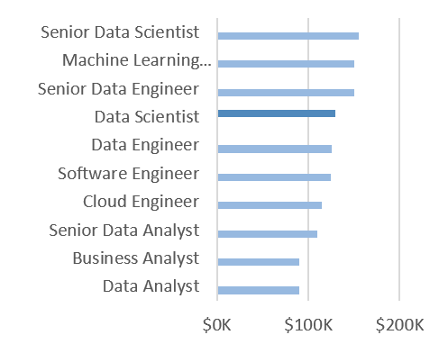
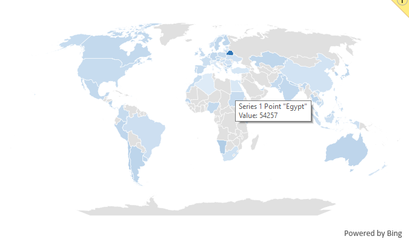
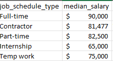
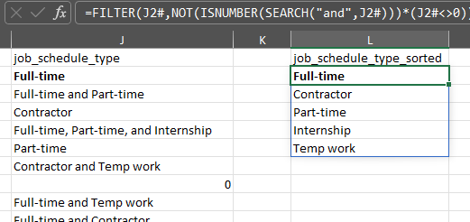
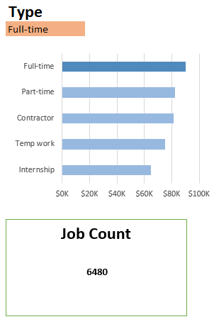

# Excel Salary Calculator


## Introduction
The Data Science Salary Calculator is an excel dashboard that provides insights into the average salaries of data jobs in 2023. It aims to provide a quick overview of salary trends in the data job market, including breakdowns by job title, location, and type of employment.

### File

The file can be found in the [Project_1](Salary_Dashboard.xlsx).

### Excel Skills Used

Following skills were used in the creation of this dashboard:

- **Charts**
- **Formulas and Functions**
- **Data Validation**

## Building the Dashboard

### Charts



- Utilized Excel's charting capabilities, with special formatting for clarity.
- Sorted by income for easy comparison.
- Data analyst jobs tend to be on the lower end of the salary spectrum, and senior positions command higher salaries.



- Utilized Excel's map chart to visualize the median salary by location.
- Color coded the map to indicate salary ranges, with a gradient from low to high.
- Missing data is represented in gray.
- The map provides a quick visual reference for salary differences across regions, as well as highlighting areas with insufficient data.

### Formulas and Functions

**Median Salary Calculation**
```excel
=MEDIAN(
  IF(
    (jobs[job_title_short]=title)*
    (jobs[job_country]=country)*
    ISNUMBER(SEARCH(A2, jobs[job_schedule_type]))*
    (jobs[salary_year_avg]<>0),
    jobs[salary_year_avg]
  )
)
```

- Filters for specific job schedules, while conforming to the other criteria.
- Uses multiplication with logical conditions to filter the data.
- Results in the table below.



**Unique Job Titles**

```excel
=FILTER(J2#,NOT(ISNUMBER(SEARCH("and",J2#)))*(J2#<>0))
```
- Filters out job titles that contain "and" and removes duplicates.
- This helps in creating a cleaner list of job titles for analysis.



Combined with the query above, this allows for a dynamic dropdown list of job titles in the dashboard with a KPI, as well as data validation for the job title selection:

```excel
=XLOOKUP(title,D2:D11, E2:E11, "No Results")
```


## Conclusion
The Data Science Salary Dashboard provides a comprehensive overview of salary trends in the data job market for 2023. It allows users to quickly assess average salaries based on job title, location, and type of employment. The use of Excel's charting capabilities, formulas, and functions enhances the dashboard's functionality and usability, making it a valuable tool for anyone interested in understanding data job salaries.