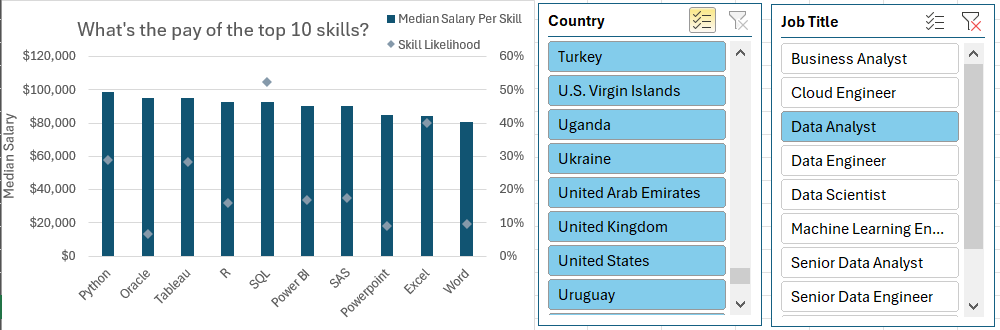

# Salary Analysis

## Introduction

This project aims to build on the previous one and provide answers to the following questions:

1. What is the relationship between skills required and salary?
3. How do salaries differ outside of the US compared to the US (note that this dataset has mostly US data)?
4. Which of the most in 
1. What are the most desired skills in the data job market?demand skills pay the most?

### File

The file can be found in the [Project_2](Project_2/Excel_job_posting_analysis.xlsx). The data is located at [data](data_jobs_salary_all.xlsx). Since Power Query is used, you might need to go to Data -> Get Data -> Data Source Settings and change the source to the correct file path.

### Excel Skills Used

- **Power Query**
- **Power Pivot**
- **Pivot Tables**
- **Pivot Charts**
- **DAX (Data Analysis Expressions)**

## 1. What is the relationship between skills required and salary?

I used **Power Query** to clean and transform the data. This resulted in two tables with following steps:

- **data_jobs_salary** - the main table containing job postings and their details.


- **data_jobs_skills** - a table containing the skills extracted from the job postings.


- There is a trend that the more skills a job posting requires, the higher the salary tends to be.
- This suggests that specialized skills are valued more highly in the job market.
- However, the relationship is not linear, and there's clearly positions that require more skills but don't seem to pay more for them.


## 2. How do salaries differ outside of the US compared to the US?


Using **Power Pivot**, I created measures to calculate:


- **Median Salary** - the median salary for each job posting.
```excel
=MEDIAN(data_jobs_salary[salary_year_avg])
```

- **Median Salary US** - the median salary for job postings in the US.
```excel
=CALCULATE([Median Salary], data_jobs_salary[job_country]="United States")
```

- **Median Salary Non-US** - the median salary for job postings outside the US.
```excel
=CALCULATE([Median Salary],data_jobs_salary[job_country]<>"United States")
```

From there it is easy to create a Pivot Table.


- US salaries are generally higher than Non-US for most roles, especially for software engineer positions, suggesting that the US market is more lucrative for that position.

- The gap narrows significantly for senior-level positions, suggesting that senior roles are more standardized in terms of pay across different countries.

## 3. What are the most desired skills in the data job market?

Using **Power Query**, I created a simple data model for the skills data, which allows for easy analysis of the most desired skills. I used the job_id created previously with **Power Query** to link the two tables together.


- SQL and Excel dominate the data analyst job market in the US, with programming tools like Python, SAS and R also being highly sought after, alongside data visualization tools like Tableau and Power BI.
- Beyond that are specific skills with ~10% or less demand.
- This clearly illustrates that when hoping to break into the data analyst job market, SQL and Excel are the most important skills to have.

## 4. Which of the most in-demand skills pay the most?

Using a **Pivot Chart**, I visualized the average salary for the most desired skills in the data job market. For this I found a custom combo chart to be the most effective.



- The chart illustrates that SQL and Excel are not only the most desired skills but also command high salaries.
- Tools like Python or Tableau also rank highly in terms of salary, indicating that they are valuable skills in the data job market.
- Oracle ranks low on the frequency of job postings but pays well, suggesting that while it may not be as commonly required, it is still a valuable skill in the market.

## Main Takeaways

- More skills generally mean higher pay — specialization/skill breadth pays.

- US postings pay more on average, though senior roles narrow the gap.

- SQL + Excel are essential; add Python/Tableau or niche enterprise tools for higher salary.