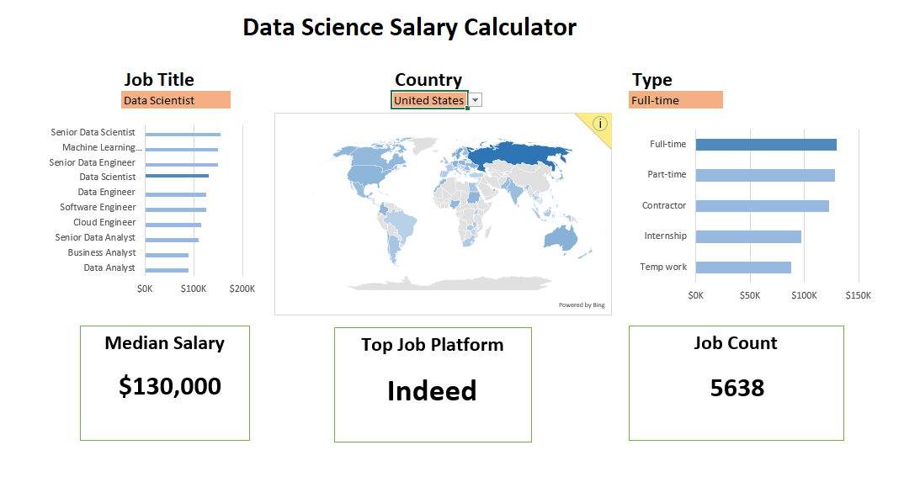
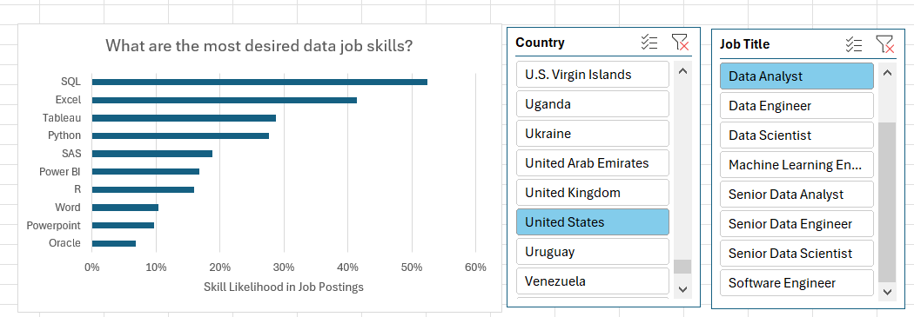
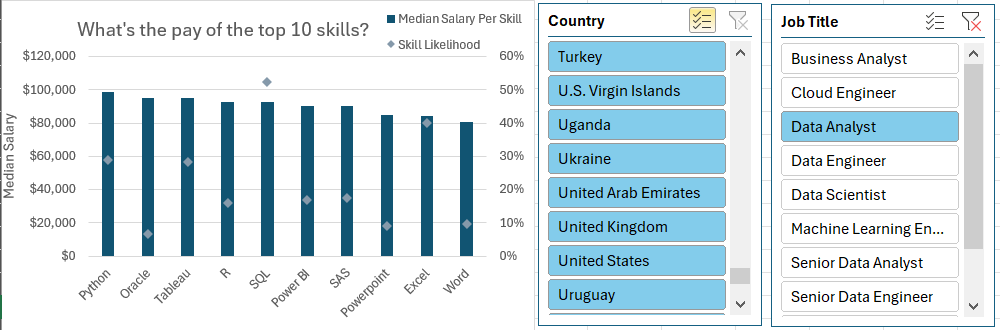

# Excel Data AnalysisAnaAawawaerterwewedaqwaaw Projects

This repository contains two projects focused on data job postings from 2023. The projects are based on this [Excel Course](https://github.com/lukebarousse/Excel_Data_Analytics_Course/tree/main).

## Salary Dashboard

A Dashboard quickly showing the average income of data jobs in 2023. It includes a breakdown by job title, location and type, as well as a few KPIs (Key Performance Indicators).  

[Check it here](Project_1)

## Salary Analysis

In the second project, we analyze the salary data in more detail. We look at the most desired skills in data job postings and how they affect salaries. The analysis includes, amongst others, visualizations of the most common skills and their impact on pay.

[Check it here](Project_2)